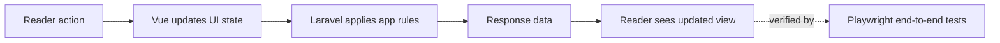

# Spine

Spine is a simple place to find, organize, and read the books that matter to you.

> **Demo status:** You can explore the app, but changes will not be saved.

**If the app has been idle, first load may take ~20 seconds.**

[Live demo](https://spine-demo-ep0b.onrender.com/)

## How It Works

1. **Discover** books in a searchable library.
2. **Add** books to your shelf.
3. **Read** without distractions.
4. **Continue** where you left off.

## App Tour

### Your shelf

See what you are reading, choose what is next, and return to recent books.

---

### Search

Find books quickly without leaving your library.

---

### Add a book

Add a book and save its details to your collection.

---

### Reader view

Read in a calm, focused view with simple controls.

---

### Bookmarks

Save your place and return to it later.

---

### Reading progress

Pick up where you stopped and see how far you have read.

---

### Settings

Set up the reading view the way you like it.

## Why I Built This

Reading apps often split finding, collecting, and reading books into separate experiences. I built Spine to keep them together. Find a book, add it to your shelf, read it, and come back when you are ready. I also wanted to read more in general and this was a fun way of motivating myself to do so.

## Technical Highlights

Spine is built so each layer does one job well.

- **Laravel** runs core reading, library, bookmark, and progress logic on the server, which keeps rules consistent across the app.
- **Vue** renders the shelf and reader as interactive screens, so readers get fast updates without full page reloads.
- **TypeScript** defines data contracts, UI state shape, and shared frontend types to reduce runtime bugs and make refactors safer.
- **Playwright** tests complete reader journeys in a real browser to verify the app works the way people actually use it.
- **PWA** support enables installable app behavior and improves reliability on unstable connections.
- **Larastan (PHPStan for Laravel)** runs static analysis on backend code to catch type and nullability issues early.

## Quality

Test coverage includes:

- Library browsing and search behavior.
- Add-to-shelf and shelf management paths.
- Reader launch, resume, and progress updates.
- Bookmark creation and return-to-bookmark flow.
- Cross-feature journeys from discovery to continued reading.

## Demo Limitations

The public demo has a few limits:

- Changes are disabled or reset.
- Personal accounts and private data are not included.
- Offline support may vary by browser.
- Admin tools are not included.

These limits apply only to the demo. They are not part of the full app.

## Roadmap

- Add clearer reading insights and history.
- Make it easier to import and export a library.
- Improve book discovery and recommendations.

## Contact

If you are a hiring manager and think I would be a good fit for a role, please reach out to me on [LinkedIn](https://www.linkedin.com/in/a-muhaymin/).
