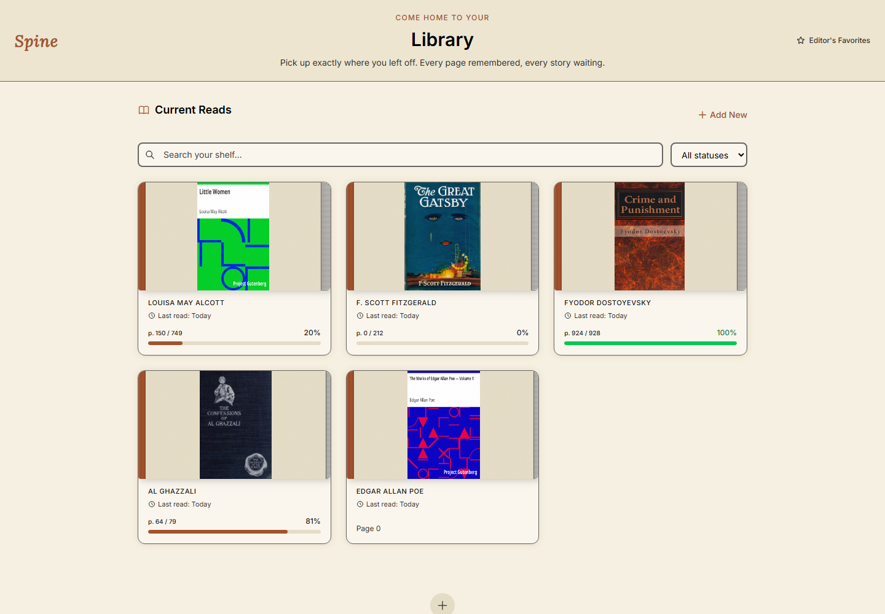
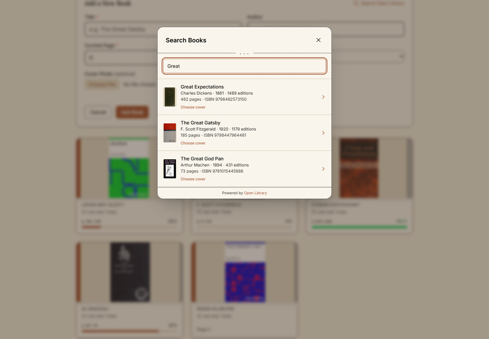
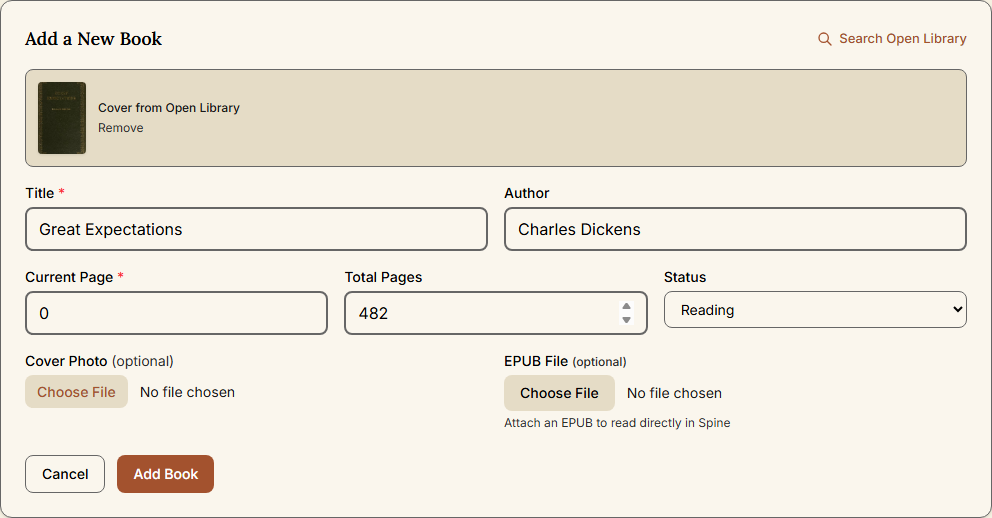
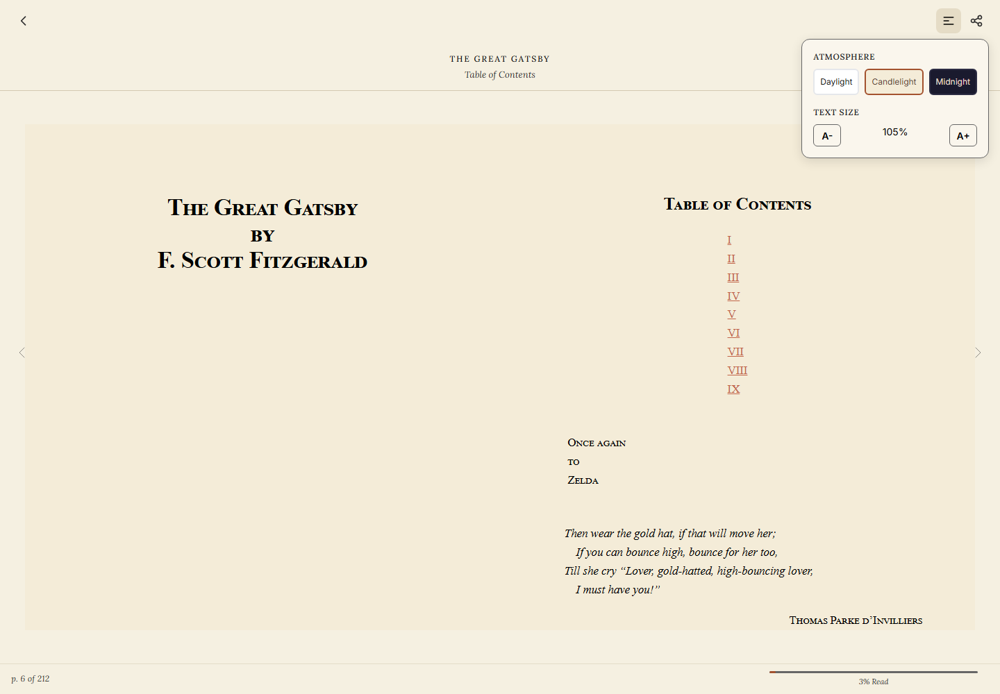
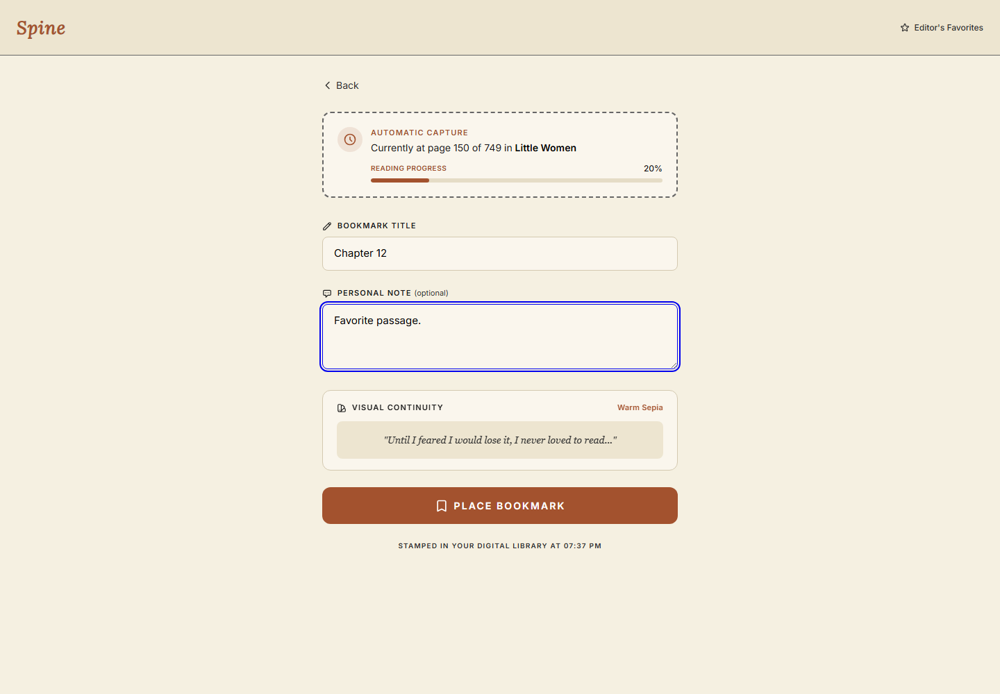
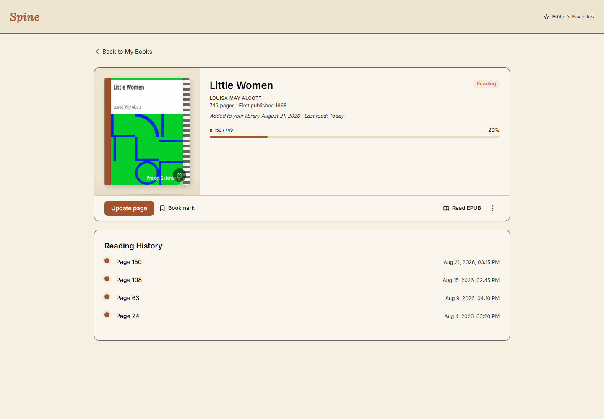
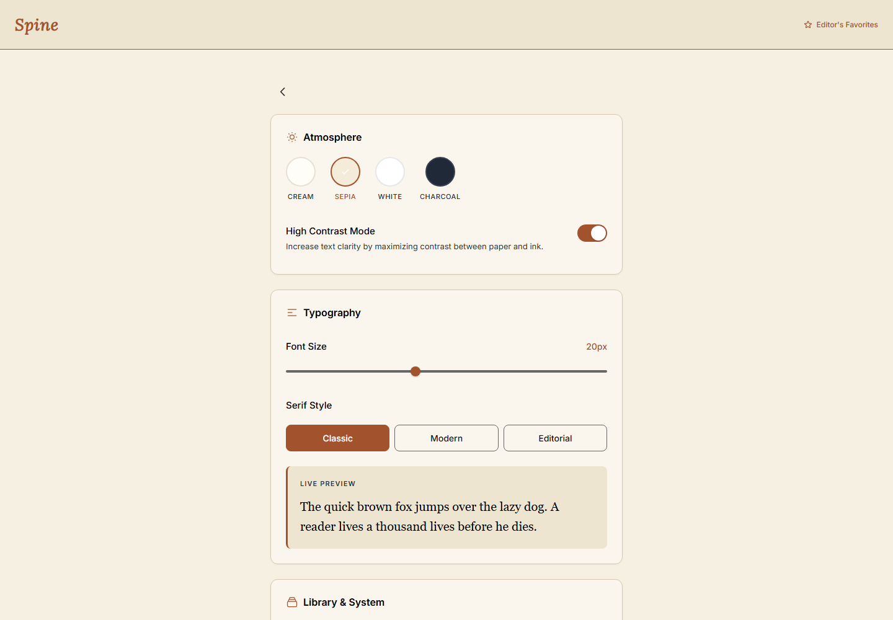
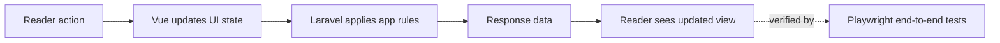

# Spine

Spine is a full-stack product demo with strong QA discipline, built to validate core web application workflows across search, reading, state persistence, and user settings.

> **Demo status:** You can explore the app, but changes will not be saved.

**If the app has been idle, first load may take ~20 seconds.**

[Live demo](https://spine-demo-ep0b.onrender.com/)

## Demo Guide

Use the live app like a product and engineering walkthrough:

1. **Search reliability**: Run several title/author queries and confirm result relevance and stable UI behavior.
2. **Add-to-shelf flow**: Add a book from search and verify metadata appears correctly on shelf and detail views.
3. **Reader continuity**: Open a book, move through content, return to shelf, then reopen and verify progress resumes.
4. **Bookmark workflow**: Create a bookmark with a note, navigate away, then return and verify location + note integrity.
5. **Settings behavior**: Change reading settings and verify they apply correctly in reader screens.

## Engineering And Quality Focus Areas

| Workflow | Primary Risk | Validation Goal | Test Levels |
| --- | --- | --- | --- |
| Search and discovery | Incorrect or unstable results | Relevant responses and consistent rendering | Vitest, Playwright |
| Add to shelf | Data mapping defects | Accurate metadata and shelf updates | PHPUnit, Vitest, Playwright |
| Reader launch and resume | State sync regressions | Correct resume position and progress tracking | PHPUnit, Playwright |
| Bookmark creation and return | Persistence and navigation errors | Saved location/note returns reliably | PHPUnit, Playwright |
| End-to-end reading journey | Cross-layer integration failures | Discovery to continued reading works as one flow | Playwright |

## How It Works

1. **Discover** books in a searchable library.
2. **Add** books to your shelf.
3. **Read** without distractions.
4. **Continue** where you left off.

## App Tour

### Your shelf

See what you are reading, choose what is next, and return to recent books.

---

### Search

Find books quickly without leaving your library.

---

### Add a book

Add a book and save its details to your collection.

---

### Reader view

Read in a calm, focused view with simple controls.

---

### Bookmarks

Save your place and return to it later.

---

### Reading progress

Pick up where you stopped and see how far you have read.

---

### Settings

Set up the reading view the way you like it.

## Why I Built This

Reading apps often split finding, collecting, and reading books into separate experiences. I built Spine to keep them together. Find a book, add it to your shelf, read it, and come back when you are ready. I also wanted to read more in general and this was a fun way of motivating myself to do so.

## Technical Highlights

Spine is built so each layer does one job well.

- **Engineering-first, quality-verified workflow** combines backend, component, and browser tests, with CI quality gates for static analysis and automated test execution.
- **Laravel** runs core reading, library, bookmark, and progress logic on the server, which keeps rules consistent across the app.
- **Vue** renders the shelf and reader as interactive screens, so readers get fast updates without full page reloads.
- **TypeScript** defines data contracts, UI state shape, and shared frontend types to reduce runtime bugs and make refactors safer.
- **Playwright** validates complete reader journeys in a real browser to verify behavior the way users experience it.
- **PWA** support enables installable app behavior and improves reliability on unstable connections.
- **Larastan (PHPStan for Laravel)** runs static analysis on backend code to catch type and nullability issues early.

## Verified Quality Metrics (Live Demo Build)

Evidence snapshot:

- Runtime: `PHP 8.4.19`, `PHPUnit 13.0.5`, `PCOV 1.0.12`

| Quality Signal | Result |
| --- | --- |
| Backend suite health | `229 passed`, `0 failed`, `695 assertions` |
| Backend coverage | `100.00% classes (46/46)`, `100.00% methods (143/143)`, `98.32% lines (877/892)` |
| PHP test inventory | `26` test files, `229` test methods |
| Browser test inventory | `14` Playwright specs, `96` test cases, `22` `test.describe()` groups |

Why this is technically meaningful:

- Backend logic has deep automated coverage across services, controllers, repositories, and validation rules.
- Coverage instrumentation includes both `app` and `Modules/Books`, so modular domain logic is measured, not skipped.
- Browser inventory confirms full user-journey checks exist for discovery, shelf workflows, reading, and persistence behavior.

## Workflow Coverage

Coverage includes:

- Search and discovery behavior across backend and browser-level tests.
- Shelf and library CRUD workflows, including sample book handling.
- Reader behavior, EPUB upload paths, and reading progress updates.
- Bookmark creation and return-to-context reliability.
- Offline sync and client behavior through frontend test coverage.
- Read-only demo behavior validation in deployment-focused tests.

## Engineering Tooling

- **PHPUnit** for backend logic and application rules.
- **Vitest** for frontend behavior and component-level confidence.
- **Playwright** for end-to-end coverage across key reader workflows.
- **Larastan** for static analysis and early defect detection.

## Software And Full-Stack Signals

- **Modular backend architecture**: Feature code is organized by domain with clear boundaries across domain, application, infrastructure, and HTTP layers.
- **Contract-driven data flow**: Request validation, typed DTOs, and frontend TypeScript contracts reduce ambiguity across client-server boundaries.
- **State and persistence reliability**: Reading position, bookmarks, and status updates are validated through both backend and browser-level scenarios.
- **Production-minded quality posture**: Static analysis, automated tests, and coverage instrumentation are all part of the regular workflow.

## Outcomes For QA, Software, And Full-Stack Roles

This project demonstrates readiness for QA automation, software engineering, and full-stack engineering roles by showing:

- Risk-based test planning across core product workflows.
- Full-stack defect investigation from UI symptoms to persisted state behavior.
- Clear module boundaries across domain, application, infrastructure, and HTTP layers.
- Typed frontend contracts and backend validation working together to protect data flow.
- Automated regression coverage across backend, frontend, and browser-level journeys.
- Clear communication of quality status in a format suitable for public review.

## Demo Limitations

The public demo has a few limits:

- Changes are disabled or reset.
- Personal accounts and private data are not included.
- Offline support may vary by browser.
- Admin tools are not included.

These limits apply only to the demo. They are not part of the full app.

## Roadmap

- Add clearer reading insights and history.
- Make it easier to import and export a library.
- Improve book discovery and recommendations.

## Contact

If you are hiring for QA automation, software engineering, or full-stack engineering roles, please reach out to me on [LinkedIn](https://www.linkedin.com/in/a-muhaymin/).
